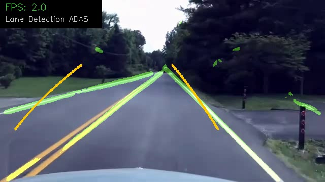

# 🚗 Lane Detection System for ADAS

Real-time lane detection pipeline combining classical Computer Vision (OpenCV)
with a deep learning segmentation model (U-Net CNN), targeting Autonomous
Driving / ADAS applications.

## 🎬 Demo



---

## 🏗️ Architecture
| Stage | Method | Details |
|---|---|---|
| Color filtering | OpenCV HSV | Isolates white & yellow markings |
| Edge detection | Canny | Gaussian blur → Canny edges |
| Perspective warp | OpenCV | Bird's-eye view transform |
| Segmentation | LaneNet (U-Net) | ~1.9M params, binary lane mask |
| Loss function | BCE + Dice | Handles class imbalance |

---

## 📦 Dataset

[TuSimple Lane Detection](https://github.com/TuSimple/tusimple-benchmark)
— 3,626 annotated highway driving clips, standard ADAS benchmark.

---

## 🚀 Quick Start

```bash
git clone https://github.com/Spnh2000/lane-detection-adas.git
cd lane-detection-adas
python3 -m venv venv && source venv/bin/activate
pip install -r requirements.txt
```

Run inference on a video:
```bash
python3 src/detect.py --video data/your_video.mp4 --weights outputs/lanenet_best.pth --output outputs/result.mp4
```

---

## 🏋️ Training (Google Colab)

Open `notebooks/train_colab.ipynb` in Google Colab (free T4 GPU).
Trains in ~1 hour. Best val loss achieved: **0.2842**

---

## 📁 Project Structure
---

## 🛠️ Tech Stack

`Python` `PyTorch` `OpenCV` `U-Net` `TuSimple` `Google Colab` `ADAS`
